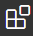
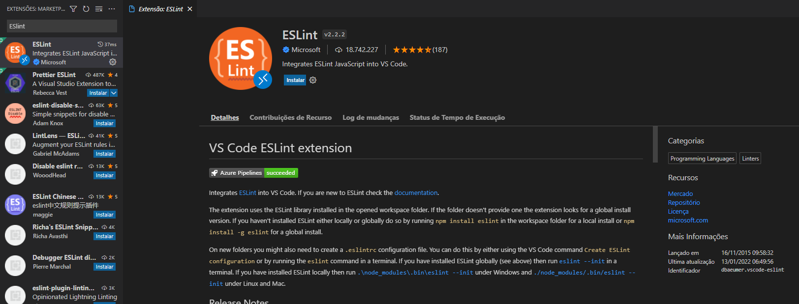
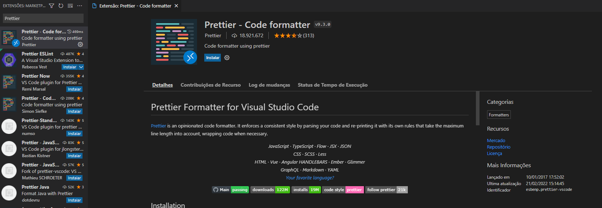

## Exercício 01 - Instalar o Eslint e Prettier

### Tarefas
1. Pelo terminal, acessar o projeto **chatcollab** no Desktop (área de trabalho) do seu SO;
2. Instalar o Eslint;
3. Instalar o Prettier


### Passo a passo
#### 1. Acessar a pasta do projeto

Abra o terminal do seu SO, se estiver no Windows use o Power Shell, Git BASH ou similares para que o comando do Linux funcione. Se estiver no Linux ou Mac, ambos têm comandos muitos similares. Agora que você já está com o seu terminal aberto vamos executar os seguintes passos:

Entre no Desktop com o comando a seguir:
```bash
cd ~/Desktop
```

Acessar a pasta **chatcollab**:
```bash
cd chatcollab
```


#### 2. Instalar o Eslint

No terminal e dentro da pasta **chatcollab** execute o comando a seguir, esse comando ira alterar um arquivo no seu projeto chamado **package.json** e durante a execução ele irá fazer algumas perguntas além de criar um arquivo oculto de configurçao chamado **.eslintrc.json**

```bash
yarn create @eslint/config
```

As perguntas que o comando vai fazer e as respectivas respostas estão a baixo:
1. How would you like to use ESLint? `To check syntax, find problems, and enforce code style`
2. What type of modules does your project use? `JavaScript modules (import/export)`
3. Which framework does your project use? `React`
4. Does your project use TypeScript? `No`
5. Where does your code run? `browser`
6. How would you like to define a style for your project? `Use a popular style guide` e depois `airbnb`
7. What format do you wnat your config file to be in? `JSON`
8. Would you like to install them now with npm? `Yes`

Se tudo deu certo você receberá uma saída similar no seu terminal:
```bash
1 package is looking for funding
  run `npm fund` for details

found 0 vulnerabilities

Successfully created .eslintrc.json file in /app
Done in 71.19s.
```

Para ver o conteúdo do arquivo **.eslintrc.json** podemos executar o comando a baixo:

```bash
cat .eslintrc.json
```
```JSON
{
    "env": {
        "browser": true,
        "es2021": true
    },
    "extends": [
        "plugin:react/recommended",
        "airbnb"
    ],
    "parserOptions": {
        "ecmaFeatures": {
            "jsx": true
        },
        "ecmaVersion": "latest",
        "sourceType": "module"
    },
    "plugins": [
        "react"
    ],
    "rules": {
    }
}
```

#### 3. Instalar o Prettier

Antes da instalação precisamos instalar 2 plugins no nosso VS Code

os plugins são:
- [ESLint](https://marketplace.visualstudio.com/items?itemName=dbaeumer.vscode-eslint)
- [Prettier - Code formatter](https://marketplace.visualstudio.com/items?itemName=esbenp.prettier-vscode)

No terminal e dentro da pasta **chatcollab** execute o comando a seguir, ele irá abrir o VS Code já com o nosso projeto

```bash
code .
```

Vá para a opção de extensões `(Ctrl+Shift+X)` representado pelo icone  e digite `ESlint` e depois clicar em instalar



Depois digitar `Prettier` e clicar em instalar




No terminal e dentro da pasta **chatcollab** execute o comando a seguir, esse comando ira alterar um arquivo no seu projeto chamado **package.json**

```bash
yarn add -D eslint-config-prettier prettier
```

> O parametro `-D` é para instalar este módulo somente para o desenvolvimento

Se tudo deu certo você receberá uma saída similar no seu terminal:
```bash
├─ which-boxed-primitive@1.0.2
├─ which@2.0.2
└─ word-wrap@1.2.3
Done in 38.96s.
```

Vamos alterar o arquivo de configuração do ESLint para ele trabalhar com o Prettier, para isso iremos abrir o arquivo .eslintrc.json e adicionar o texto `"prettier"` depois do `"airbnb"` na sessão extends ficando conforme é mostrado a baixo:

```JSON
{
    "env": {
        "browser": true,
        "es2021": true
    },
    "extends": [
        "plugin:react/recommended",
        "airbnb",
        "prettier"
    ],
    "parserOptions": {
        "ecmaFeatures": {
            "jsx": true
        },
        "ecmaVersion": "latest",
        "sourceType": "module"
    },
    "plugins": [
        "react"
    ],
    "rules": {
    }
}

```

Agora vamos criar o arquivo para armazenar as configurações do prettier que será o arquivo oculto **.prettierrc** no terminal dentro da pasta **chatcollab**

```bash
touch .prettierrc
```

Agora podemos abrir o arquivo pelo vscode ou por um editor de texto dentro do terminal, eu vou utilizar o VIM para isso.

```bash
vim .prettierrc
```

E colocar o conteúdo a baixo dentro deste arquivo
```JSON
{
  "singleQuote": true,
  "trailingComma": "all",
  "semi": true
}
```